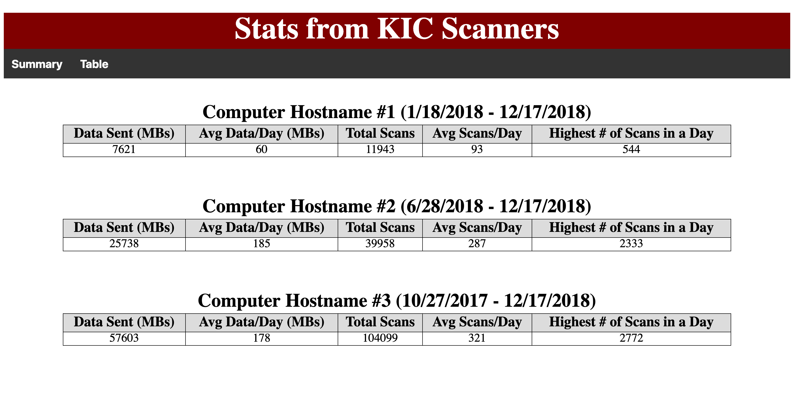
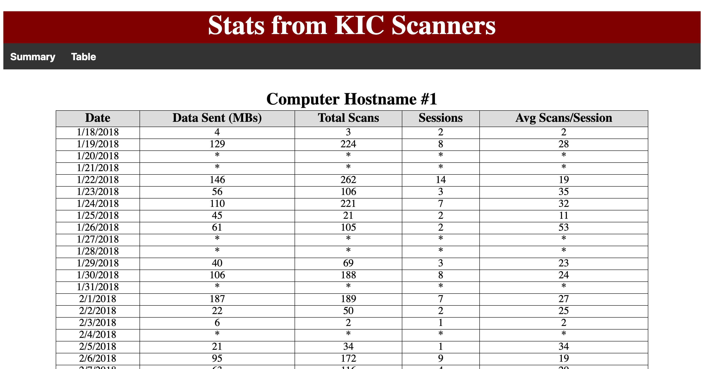

# KIC-Stats

The code in this repo takes the daily usage statistics XML data output by Knowledge Imaging Center (KIC) scanner software and displays it in a web browser for general analysis that may help inform business/budgetary decisions and KIC configuration settings. 

This code was originally developed and tested using XML output from version 4.2.0.0 of the software. The XML appears to be consistent between this version and at least version 6.0.3.1.

The KIC Fleet Manager software available for purchase from Image Access provides much more functionality. The code in this repo is meant to be a free alternative for institutions that wish to have a way to look at a cleaned up version of important data without the cost (and all the extra features) that the Fleet Manager software provides.

See the following sites for more information about KIC scanners:

* [Image Access](https://www.imageaccess.com)
* [KIC](https://www.kic.com)
* [Digital Library Systems Group](https://www.dlsg.com)

## Using the Code
This front-end project was built with basic HTML, CSS, and vanilla JS. Loading the XML data from your computer will require that you run a local web server as browsers restrict cross-origin HTTP requests initiated from within local scripts as a security precaution.

Configure the KIC scanner to send the daily statistics email in KIC Setup. Download the zip file with the XML data that is attached to the email, unzip the file, and rename the file to "yourfilename.xml". Ensure that the name of the file is coded into the array variable "XMLFiles" in [script.js](assets/script.js). Repeat this process with as many XML files as you wish. Note that the script currently looks for the XML files within a directory entitled "xml".

The script can create two types of tables. The first is a high level view that looks at the entirety of the recorded data in the file and provides a summary between the first and last dates of recorded data.

The second includes the amount of data sent, total number of scans, total number of sessions, and the average number of scans per session for each day that the KIC was able to write data.

## Authors
**Jordan Bradford** - GitHub: [jrdnbradford](https://github.com/jrdnbradford)

## License
MIT License. See [LICENSE.txt](LICENSE.txt) for details.